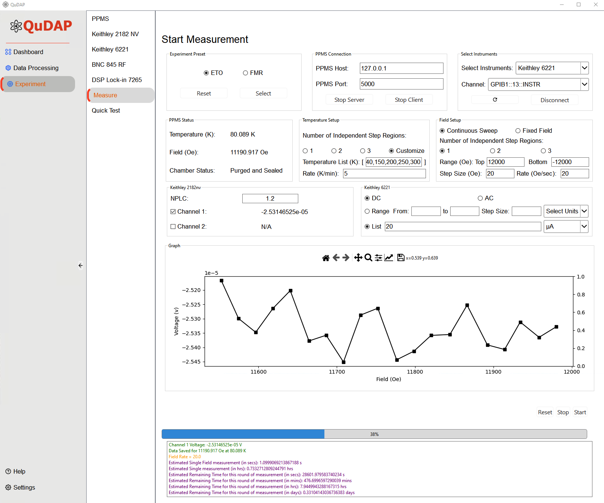

# Summary

Quantum Materials Data Acquisition and Processing (QuDAP), a Python-based and open-source software package, is designed to control and automate material characterizations based on the Physical Property Measurement System (PPMS) [@ppms]. The software supports major hardware interfaces and protocols (USB, RS232, GPIB, and Ethernet), enabling communication with the measurement modules associated with the PPMS. It integrates multiple Python libraries to realize instrument control, data acquisition, and real-time data visualization. Here, we present features of QuDAP, including direct control of instruments without relying on proprietary software, real-time data plotting for immediate verification and analysis, full automation of data acquisition and storage, and real-time notifications of experiment status and errors. These capabilities enhance experimental efficiency, reliability, and reproducibility.

# Statement of need
The exploration of quantum materials [@azam2022laser; @awschalom2021quantum; @kumari2021recent; @wei2020emerging] has gained significant interest over decades, benefiting from their unique properties at the quantum level, compact size, and low energy consumption. These materials are promising candidates for applications in future quantum computers, sensors, and memory devices. Studying the intriguing properties of quantum materials demands extreme conditions such as low temperature, high magnetic field, and ultra-high vacuum environments. Therefore, many experimental approaches have been employed to characterize quantum materials, including magnetometry [@foner1956vibrating], spectroscopic techniques [@tang2023spin; @rahman2021recent], electrical transport [@nagaosa2010anomalous; @rojo2013review], thermal transport [@goyal2023methodology; @kalantari2022thermal], and advanced microscopy [@zhang2018atomic; @li2018mechanical]. Among them, the Physical Property Measurement System (PPMS, Quantum Design) provides the capability to achieve those goals with precise control of temperature and magnetic field under a high vacuum environment. In this process, PPMS needs to communicate with multiple peripheral instruments through hardware interfaces, including USB, RS232, GPIB, and Ethernet. To control and automate the data acquisition, software is needed to integrate the Standard Commands for Programmable Instruments (SCPI) protocol [@Keysight]. 

QuDAP is a Python-based data acquisition and processing software package to control and automate quantum material characterization experiments. It is developed based on the measurement modules of Quantum Design DynaCool PPMS including magnetometry, electrical transport, and ferromagnetic resonance spectroscopy. This software package provides a graphic user interface to visualize and process the experimental data in real-time, giving the users a more efficient way to monitor the experiment. \autoref{fig1} demonstrates the connection utility of this software. All the instruments are connected through the hardware interface of USB, RS232, GPIB, and ethernet. The commands for each instrument are sent using PyVISA [@Grecco2023] and MultiPyVu [@multipyvu]. The software provides the benefits as summarized below:
1. Provide direct Python script communication and control of PPMS and instruments without using the built-in software, which improves the tunability and efficiency of the experiment.
2. Built-in demagnetization process before each measurement to enhance the reliability of the measurement.
3. Fully automated data acquisition and saving process with real-time plotting and progress visualization.
4. Save the data with specific identifiers to avoid data overwrite and record the experiment configuration of each measurement.
Real-time notification on the measurement status and program error through push notification, allowing the user to promptly identify and verify the experimental and parameter setup.
5. Various post data pocessing features allowing to process optical, magnetic, and electrical data.

In the following sections, we introduce the peripheral instruments we have integrated into our software and show the experiment procedure for this software. 

![Block Diagram of the instrumentation of QuDAP. The QuDAP software establish the instrument communication using USB, RS232, and GPIB to control the PPMS [@ppms], BNC845 [@BNC845], Keithley 6221 [@keithley6221], Keithley 2182 [@keithley2182], and DSP7265 [@DSP7265].\label{fig1}](Figure1.pdf)

# Graphic User Interface
QuDAP utilizes MultiPyVu for controlling the PPMS. It is a socket-based server/client that enables both readback and control of the temperature, magnetic field, and chamber operations of the sample environment. MultiPyVu also contains a wait function that allows the user to pause the operation until the desired stability criteria are met, while an additional class simplifies the writing of MultiVu-readable data files.

The interface of the software is shown in \autoref{fig2}. It contains three parts from left to right: main menu, options sidebar, and run window. The main menu allows users to select the option of the dashboard, data processing, and experiment. The detailed options are shown in the options sidebar once select the main option. The software starts up to the dashboard window, which shows all the connections from VISA. The dashboard window also provides the feature of quick access to the functions and directs to the selected page. The data processing options feature data processing from various quantum materials characterization, including magnetometry, ferromagnetic resonance, and electrical transport. The last option on the main menu is the experiment option. Under the experiment option, there are features of individual control for each instrument, preset experiment type, and quick test. The individual instrument gives the user many options to control each feature. Besides, QuDAP allows users to customize the experiment setup to link and control instruments. The preset measurements can be found under the Measurement tab in the option sidebar. This feature provides the users with the preset script for both ETO and FMR measurements. Once selecting the preset option, the user will connect instruments and set up the parameters. A log panel will pop up when the user presses the start button and the experimental log will be recorded as a txt file. To facilitate the data management, an example of the data file naming convention will be proåvided. After the measurement starts, in the backend, the software will check all the parameters to ensure a valid entry. The real-time data point will be shown in the run window and users will receive push notifications from Telegram once the measurement is done or some unexpected error happens. The quick Test option allows the users to do the measurements without the constraint of the preset script. Users can select the instruments they need for specific experiments. After the measurements are finished, users can find metadata as well as the recorded experimental under the preselected folder and process the data under the data processing option.

This software is available in the format of a Python script file, and users can run the program based on their operating system. It will also pack into an executable software for those who do not have experience in Python programs.

# Acknowledgements

S. W was funded by Collaborative Approaches among Scientists and Engineers REU National Science Foundation EEC Division Grant 2349639.

# References